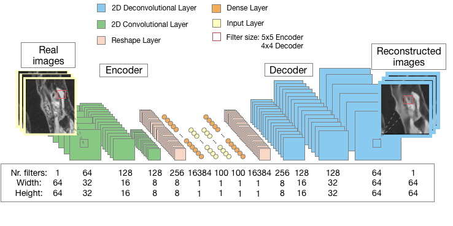
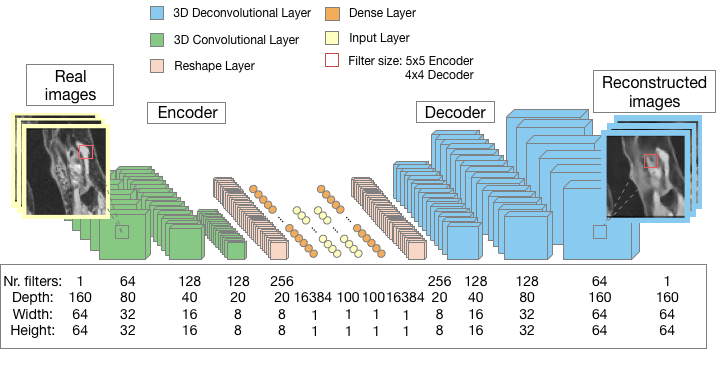
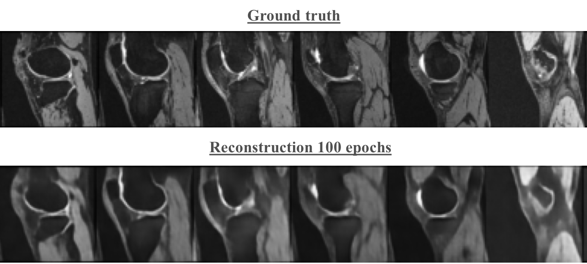
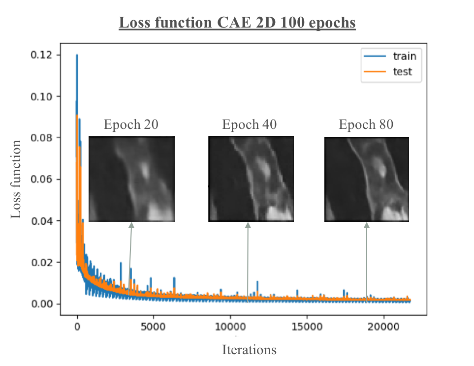
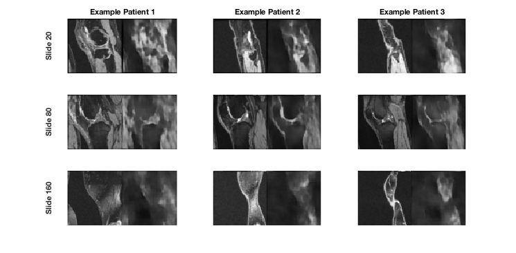
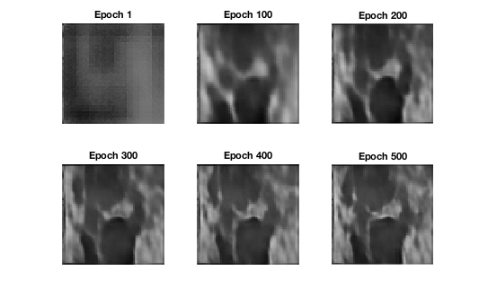
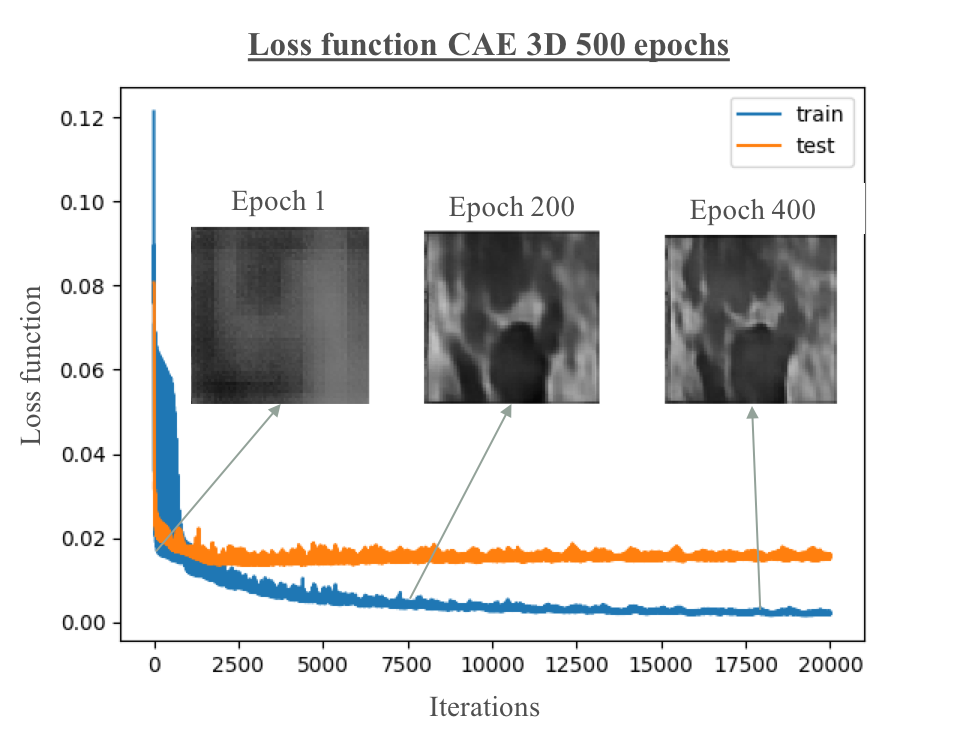

# 2D-and-3D-Deep-Autoencoder
Convolutional AutoEncoder application on MRI images 

Application of a deep convolutional autoencoder network on MRI images of knees. The MRI database used was provided by Imperial College London, however similar databases can be found on the OAI website (http://www.oai.ucsf.edu/), an observational study dedicated to monitor the natural evolution of osteoarthritis.
The original dataset was comprised of 3D images of 160x64x64 from 180 patients.
The 2D dataset used in this project combined the images coming from different patients into 28800 2D black&white MRI images of size 64x64.
The 3D dataset has a shape of 180x1x160x64x64.

# Prerequisites
- Python, Lasagne (developer version), Theano (developer version), Numpy, Matplotlib, scikit-image
- NVIDIA GPU (5.0 or above)
# Architectures 

- **2D CAE** 

  
- **3D CAE** 

  
# Results

## 2D CAE

The hyperparameters used were:
- a learning rate of 0.0005
- a decay rate of 0.5
- a batch size of 128 images 
- a z space of 100 

The network was trained using 100 epochs (22500 iterations).

- **Comparison between input images (top) and decoded images (bottom)** 

- **Loss function for 2D CAE**

## 3D CAE
Since 180 3D images were considered, the network was trained on 500 epochs with a batchsize of 4 images. A larger batchsize could not be used due
to GPU memory constraints. Better results might be obtained by tweaking these hyperparameters.
In order to quickly visualize and monitor the results, different depths of the 3D images were extracted and compared with the original images at the same depth.
- **Results for 3D CAE**

- **Traning evolution 3D CAE**

- **Loss function for 3D CAE**

# License
This project is licensed under Imperial College London.
# Acknowledgements

The CAE model used in this application was granted by Antonia Creswell and can be found here: https://github.com/ToniCreswell/ConvolutionalAutoEncoder

